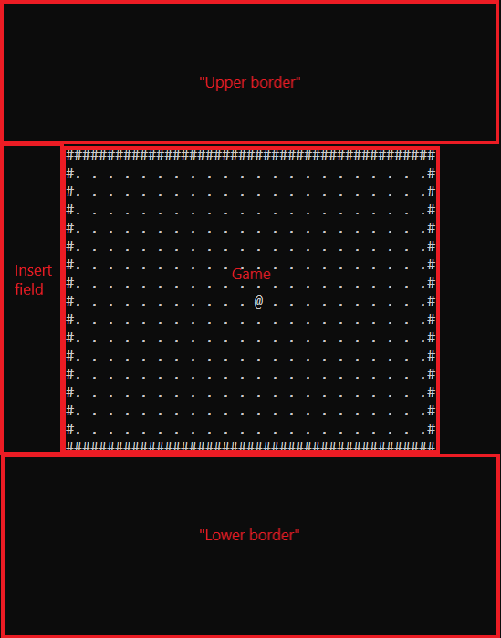

# Install

## Downloads
1. Download <a href="here">https://github.com/nguyenphuminh/Corpse/releases</a>
2. Clone from Github:

        git clone https://github.com/nguyenphuminh/Corpse.git

# Start using Corpse
Create a main file, for now, let's create a "Game.bat":

    @echo off
    title My_First_Corpse_Game
    call c_engine.bat
    
Then, create a file called "core.bat", this file will contains the initialization for your game.

# Engine's basics
Here's a brief look at how Corpse would work:

* The "Insert field" is where you can insert anything you like. But mostly there would be spaces or tabs if you want to balance game's width when changing the game's windows's width.
* The "Upper Border" and "Lower Border" are also free spaces which you can insert stuffs in as well, but it is mostly used to displat stats like health, levels,...
* The "Game", is of course, the game screen itself.

# Initialization
## Set character's spawn position

    set xinit=*xposition*
    set yinit=*yposition*

    :: Example:
    :: set xinit=1
    :: set yinit=1

If you don't declare "xinit" and/or "yinit", it will be set as 1-1 by default.

## Set character's texture

    set charinit=*character*
    :: Example: set charinit=@

## Set border's texture

    set borinit=*character*
    :: Example: set borinit=$

## Set floor/land's texture

    set floorinit=*character*
    :: Example: set floorinit=.

## Set a specific position's texture

    set *position*=*character*
    :: Example: set x5y4=#

## Set positions for walls (position you can't walk in)

    set wallinit=*list of positions*
    :: Example: set wallinit=x2y3 x6y2 x5y3

## Set game's window's width

    set gsinit=*size*
    :: Example: set gsinit=100

If you ignore "gsinit", it will set the size to 61 by default

# Callbacks and events
## Callbacks
Create one of these files to execute callbacks:

* "bfrcallback.bat" will be executed before the graphic's changed.
* "aftcallback.bat" will be executed after the graphic's changed.
* "ecallback.bat" will be executed when the "end" event is triggered.

## Events
### End the game
To end the game, add this in one of the callback files:

    set cgame_status=end
